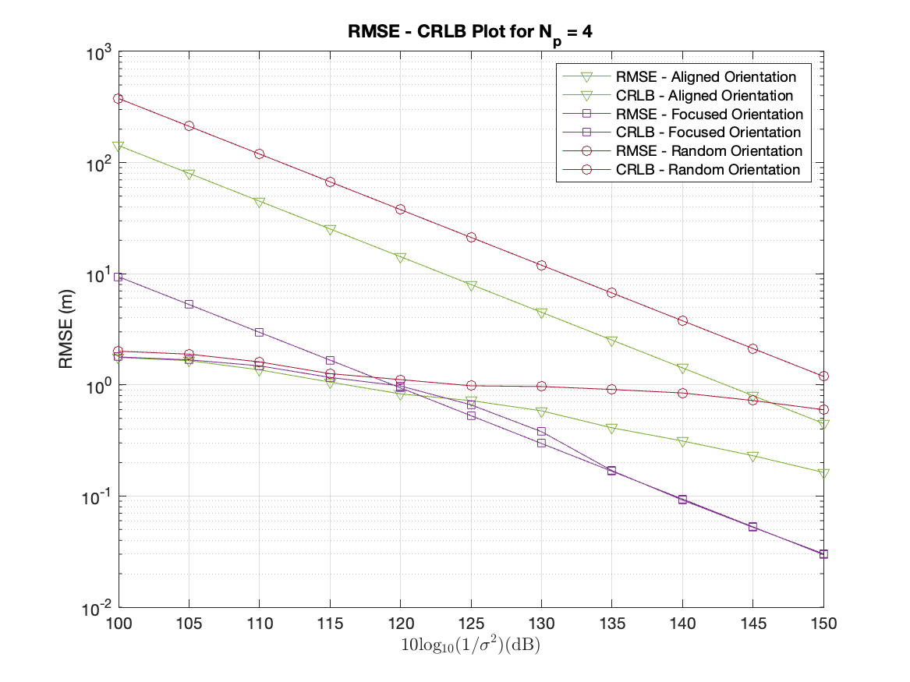
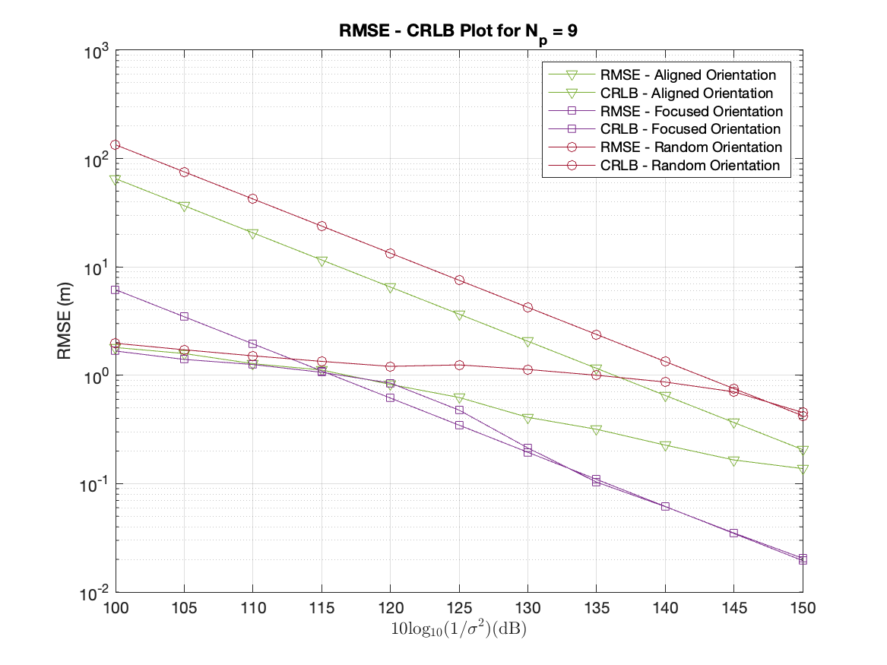
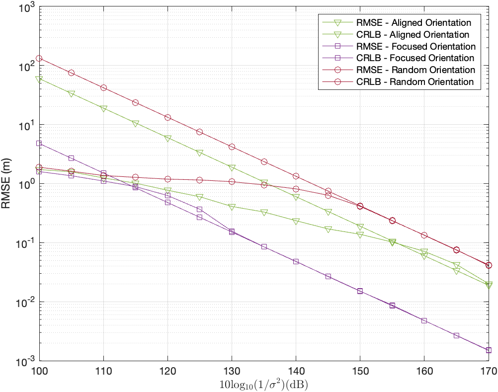
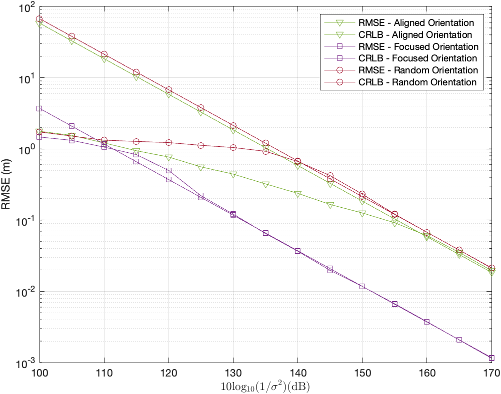
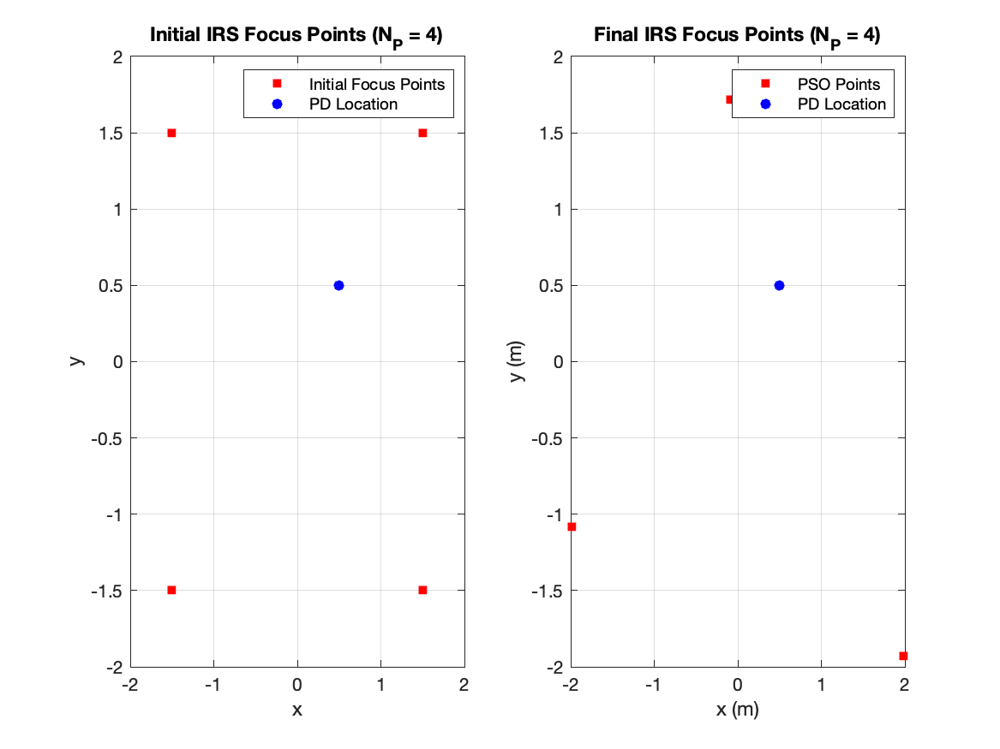
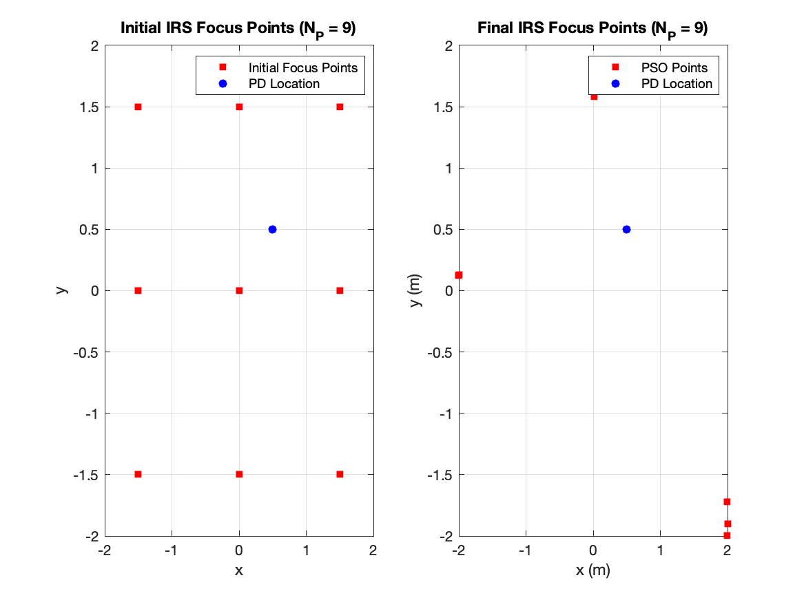
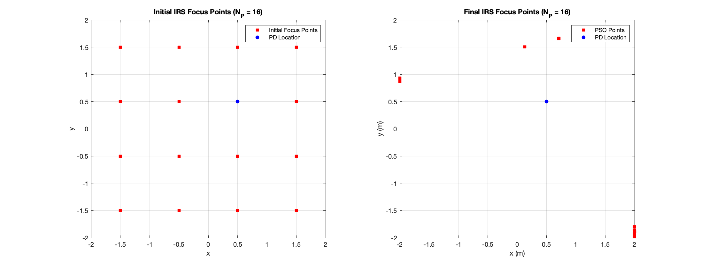
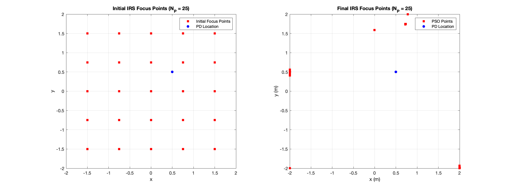
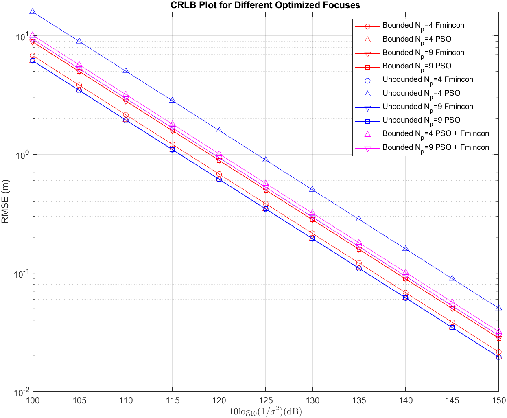

# IRS-Aided Visible Light Positioning with a Single LED Transmitter

[](https://www.sciencedirect.com/science/article/pii/S105120042400424X)
[](https://doi.org/10.1016/j.dsp.2024.104799)
[](https://scholar.google.com/scholar?q=10.1016%2Fj.dsp.2024.104799)
[](LICENSE)

> Companion code for the *Digital Signal Processing* (Elsevier, 2025) article on
> single-LED VLP positioning through an intelligent reflecting surface (IRS).

**Authors:**
[Efe Tarhan](https://tarhanefe.github.io) ·
[Furkan Kökdoğan](https://www.researchgate.net/profile/Furkan-Koekdogan) ·
[Sinan Gezici](https://www.ee.bilkent.edu.tr/~gezici/)

**Paper:** [📄 IRS aided visible light positioning with a single LED transmitter](https://www.sciencedirect.com/science/article/pii/S105120042400424X) — *Digital Signal Processing*, Vol. 156, 104799 (2025). DOI: [10.1016/j.dsp.2024.104799](https://doi.org/10.1016/j.dsp.2024.104799)

---

## Overview

This repository contains MATLAB code that reproduces the results of the paper. The
study investigates visible-light positioning (VLP) in indoor environments where
the line-of-sight (LoS) between a single LED and the receiver is blocked. A wall
of individually-tilted micro-mirrors — an **Intelligent Reflecting Surface (IRS)** —
is used to redirect the LED signal into the room, enabling non-line-of-sight
(NLoS) localization. The IRS profile (one orientation per mirror group) is
optimized to minimize the Cramér–Rao lower bound (CRLB) of the position estimator.

Key elements:

- **Time-division multiplexing** scheme that reuses a single LED across multiple
  IRS configurations to produce a sequence of independent measurements.
- **CRLB analysis** of the resulting NLoS channel as a function of receiver position,
  mirror count, and noise variance.
- **IRS-profile optimization** with both gradient-based (`fmincon`) and metaheuristic
  (PSO) solvers, in bounded, unbounded and ensemble variants.
- **Maximum-likelihood position estimator** evaluated against the CRLB via Monte-Carlo
  RMSE simulations.

## Repository Layout

```
ml-vlp-irs/
├── README.md
├── LICENSE
├── setup_paths.m         <- run once before any script
├── functions/            <- core simulation + optimization functions
├── scripts/              <- entry-point scripts that reproduce the paper figures
│   └── legacy/           <- scratch / unused scripts kept for reference
├── data/                 <- precomputed .mat results (CRLB, optimized profiles, RMSE)
│   ├── bounded_single_optim/
│   ├── bounded_ensemble_optim/
│   ├── unbounded_single_optim/
│   ├── data_rmse_crlb_all/
│   ├── grid_results/
│   └── figures/          <- raw figure exports tied to the data
├── figures/              <- paper figures (png/eps/fig + overleaf source)
└── fingerprinting/       <- side project (ML-based VLP fingerprinting)
```

## Getting Started

Tested with MATLAB R2022b or newer. The Optimization Toolbox and Global Optimization
Toolbox are required for `fmincon` / `particleswarm`.

```matlab
% from the repository root
>> setup_paths              % adds functions/ and fingerprinting/functions/ to the path
>> cd scripts
>> demo_room_and_irs        % minimal IRS scene + power-map demonstration
>> rmse_focused_scenario    % CRLB / RMSE curve for the optimized focused-IRS scenario
>> plot_paper_figures       % reproduces the RMSE / CRLB comparison figures
```

Most heavy results (optimized profiles, ensemble runs, Monte-Carlo RMSE) are
already cached as `.mat` files under [data/](data/), so the plotting scripts run
in seconds without re-running the optimization.

## Scripts

All scripts are in [scripts/](scripts/) and assume `setup_paths` has been run.

| Script                                                                       | Purpose                                                            | Data folder                                                                                                  |
|------------------------------------------------------------------------------|--------------------------------------------------------------------|--------------------------------------------------------------------------------------------------------------|
| [demo_room_and_irs.m](scripts/demo_room_and_irs.m)                           | Build a room/IRS scene and visualize received-power maps           | —                                                                                                            |
| [compare_irs_profiles.m](scripts/compare_irs_profiles.m)                     | CRLB comparison between random / aligned / focused IRS profiles    | —                                                                                                            |
| [crlb_vs_N.m](scripts/crlb_vs_N.m)                                           | Effect of the number of mirror groups *N* on the CRLB              | —                                                                                                            |
| [crlb_grid_sweep.m](scripts/crlb_grid_sweep.m)                               | CRLB heatmap evaluated over a grid of receiver positions           | [data/grid_results/](data/grid_results/)                                                                     |
| [optimize_focused_profiles.m](scripts/optimize_focused_profiles.m)           | Run PSO to optimize the focused IRS profile for *N* ∈ {4, 9, 16, 25} | [data/bounded_single_optim/](data/bounded_single_optim/)                                                     |
| [rmse_focused_scenario.m](scripts/rmse_focused_scenario.m)                   | Monte-Carlo RMSE evaluation of the focused-profile scenario        | [data/bounded_single_optim/](data/bounded_single_optim/)                                                     |
| [run_rmse_evaluation.m](scripts/run_rmse_evaluation.m)                       | RMSE sweep across {random, aligned, focused} × {4, 9, 16, 25}      | [data/data_rmse_crlb_all/](data/data_rmse_crlb_all/)                                                         |
| [plot_paper_figures.m](scripts/plot_paper_figures.m)                         | Re-plot every RMSE / CRLB figure used in the paper                 | [data/data_rmse_crlb_all/](data/data_rmse_crlb_all/)                                                         |

### Legacy / Scratch (not used in the paper)

The [scripts/legacy/](scripts/legacy/) folder holds files that were kept for
historical reference but are **not** used to produce the paper's figures:

- `sketch_rectangles.m` — early 2-D layout sketch
- `seed_sensitivity_check.m` — sanity check on RNG seed influence
- `scratch_optim_sweeps.m` — author's scratch script with redundant / speculative sweeps

## Selected Figures

### Optimized Single-LED IRS Focus

| N = 4 | N = 9 | N = 16 | N = 25 |
|:---:|:---:|:---:|:---:|
|   |   |  |  |

### Focus-Point Optimization

| N = 4 | N = 9 | N = 16 | N = 25 |
|:---:|:---:|:---:|:---:|
|  |  |  |  |

### CRLB Across Optimization Strategies



## Side Project: Fingerprinting

The [fingerprinting/](fingerprinting/) folder contains an independent, exploratory
study on **machine-learning-based** VLP (KNN and fully-connected neural-network
fingerprinting on IRS power measurements). It is *not* part of the published paper
— see [fingerprinting/README.md](fingerprinting/README.md) for details.

## Citation

If you use this code or its results, please cite:

```bibtex
@article{tarhan2025irs,
  title   = {IRS aided visible light positioning with a single LED transmitter},
  author  = {Tarhan, Efe and Kokdogan, Furkan and Gezici, Sinan},
  journal = {Digital Signal Processing},
  volume  = {156},
  pages   = {104799},
  year    = {2025},
  publisher = {Elsevier},
  doi     = {10.1016/j.dsp.2024.104799},
  url     = {https://doi.org/10.1016/j.dsp.2024.104799}
}
```

## License

See [LICENSE](LICENSE).
